# solar_birthday_cos 项目说明（超详细版）

[](./LICENSE)


> 背景：Apple 生态中的 Calendar 不支持农历日期提醒，故此开发这个项目来补齐农历提醒能力。

## GitHub 数据卡片


---

## 0. 一句话说明

这是一个“时间事件日历生成器”：

1. 录入生日/重要事件/纪念日（公历日期）。
2. 对生日按农历规则逐年换算回公历，生成每年事件。
3. 产出 `ICS` 文件，上传到腾讯云 COS 后供日历客户端订阅。

## 0.1 这个项目具体都能干什么（详细）

### A. 数据管理能力

1. 支持三类事件：`生日`、`重要事件`、`纪念日`。
2. 每条记录可维护字段：
- 名称
- 公历日期
- 可选准确时间（`HH:MM`）
- 可选备注
- 可选单独提醒天数（如 `14,7,0`，`-1` 不提醒）
- 标签（生日/重要事件/纪念日）
3. 提供完整 CRUD：
- 新增
- 编辑
- 删除（软删除）
- 查询列表

### B. 生日按农历周年计算能力

1. 录入的是出生公历日期。
2. 系统会先换算出对应农历生日。
3. 生成年份事件时：
- 出生年份使用真实出生公历日期
- 后续年份按农历生日换算成当年公历日期
4. 适合“按农历过生日”的场景。
5. 当前农历计算支持到 `2099` 年。

### C. 提醒能力

1. 支持全局默认提醒天数（可在页面顶部直接修改并保存）。
2. 支持单条记录覆盖默认提醒。
3. 支持 `-1` 关闭某条提醒。
4. 当前规则是“按输入原样保存”，不会自动收敛改写。

### D. ICS 生成能力

1. 一键生成 `private_data/birthdays.ics`。
2. 每条记录会生成多年的日历事件（按起止年份）。
3. 每个事件包含 `SUMMARY`、`DTSTART/DTEND`、`DESCRIPTION`、`CATEGORIES`、`VALARM`。
4. 生日事件描述里会包含年龄、生肖、农历信息等。

### E. Web 页面能力

1. 本地网页可视化维护数据（无需记命令）。
2. “时间列表”支持标签筛选：`全部 / 生日 / 重要事件 / 纪念日`。
3. 名称显示规则：
- 标签是 `生日`：显示“名字的生日”
- 其他标签：显示原名称
4. 提供“最近删除”区：
- 可恢复单条
- 可全部恢复

### F. 云端订阅能力

1. 可将生成的 ICS 上传到腾讯云 COS。
2. 上传后可在手机/电脑日历客户端订阅。
3. 每次覆盖上传后，需手动确认对象权限为 **公有读私有写**。

### G. 开源发布能力（隐私隔离）

1. 隐私数据集中在 `private_data/`：
- `birthdays.db`
- `birthdays.ics`
- `cos.env`
2. `private_data/*` 已被 `.gitignore` 忽略，便于发布 GitHub 代码仓库而不泄露隐私数据。

---

## 1. 项目做什么、怎么做（含逐步命令）

## 1.1 你会得到什么

- 本地数据库：`private_data/birthdays.db`
- 本地导出文件：`private_data/birthdays.ics`
- 本地网页管理界面：`http://127.0.0.1:8898/`

## 1.2 目录结构（当前）

```text
solar_birthday_cos/
├─ solar_birthday.py
├─ scripts/
│  ├─ web.sh
│  ├─ generate.sh
│  └─ upload_cos.sh
├─ web/
│  ├─ index.html
│  ├─ app.js
│  └─ styles.css
├─ private_data/                # 隐私数据目录（已忽略）
│  ├─ birthdays.db
│  ├─ birthdays.ics
│  ├─ cos.env
│  └─ .gitkeep
├─ .gitignore
└─ README.md
```

## 1.3 环境准备

```bash
cd /Users/apple/Documents/PyCharm/solar_birthday_cos
python3 --version
python3 -m pip install lunardate
```

## 1.4 命令行完整流程

### 第 1 步：初始化数据库

```bash
python3 solar_birthday.py init --db private_data/birthdays.db
```

### 第 2 步：添加记录

```bash
python3 solar_birthday.py add --db private_data/birthdays.db --name "妈妈" --date 1968-03-06 --tag 生日
python3 solar_birthday.py add --db private_data/birthdays.db --name "项目上线" --date 2026-05-09 --tag 重要事件
python3 solar_birthday.py add --db private_data/birthdays.db --name "领证" --date 2020-10-01 --tag 纪念日
python3 solar_birthday.py add --db private_data/birthdays.db --name "我" --date 1990-08-15 --time 08:30 --alarm-days 14,7,0 --note "请准备蛋糕"
```

参数说明：

- `--name`：名称
- `--date`：`YYYY-MM-DD`
- `--time`：可选，`HH:MM`
- `--alarm-days`：可选，例 `14,7,0`；`-1` 表示不提醒
- `--note`：可选备注
- `--tag`：`生日/重要事件/纪念日`，默认 `生日`

### 第 3 步：查看记录

```bash
python3 solar_birthday.py list --db private_data/birthdays.db
```

### 第 4 步：生成 ICS

```bash
scripts/generate.sh
```

等价命令：

```bash
python3 solar_birthday.py generate \
  --db private_data/birthdays.db \
  --out private_data/birthdays.ics \
  --start-year "$(date '+%Y')" \
  --end-year 2099 \
  --calendar-name "家庭公历生日" \
  --alarm-days 7
```

### 第 5 步：上传 COS

#### 方式 A：手动上传（推荐）

1. 进入 COS 控制台。
2. 找到对象路径对应目录。
3. 覆盖上传 `private_data/birthdays.ics`。
4. 确认对象权限为 **公有读私有写**。
5. 确认 Content-Type 为 `text/calendar; charset=utf-8`。
6. 每次覆盖上传后都手动复查权限，若被改动，改回 **公有读私有写**。

#### 方式 B：脚本上传（需 coscli）

```bash
scripts/upload_cos.sh
```

脚本会读取：`private_data/cos.env`

---

## 1.5 Web 操作流程

启动：

```bash
scripts/web.sh
```

访问：`http://127.0.0.1:8898/`

页面功能：

1. 新增/编辑/删除记录
2. 标签选择：`生日 / 重要事件 / 纪念日`
3. 顶部可修改“默认提醒天数”，点击“保存默认提醒”生效
4. 点击“生成 ICS”
5. 时间列表支持标签筛选（全部/生日/重要事件/纪念日）
6. 最近删除区支持“恢复单条 / 全部恢复”

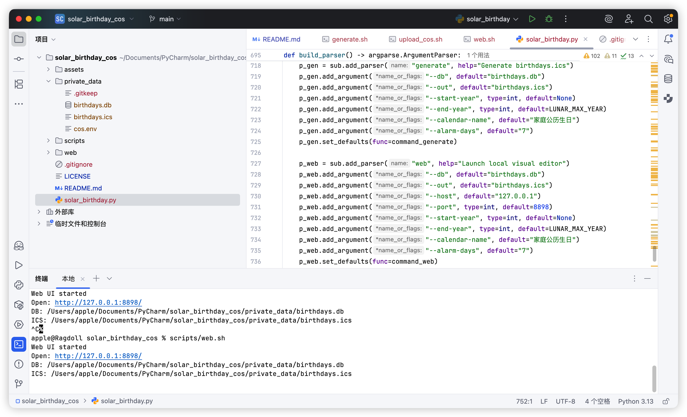

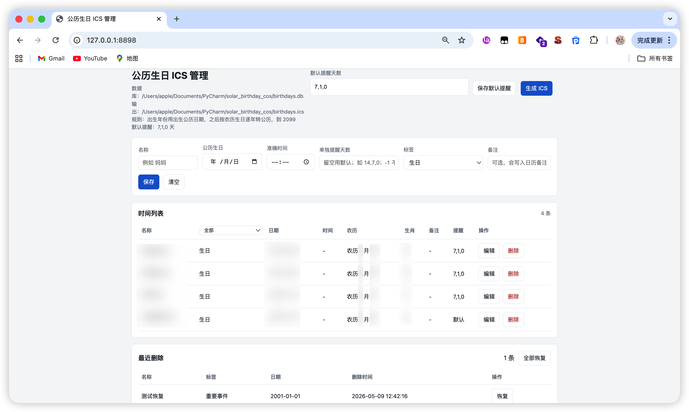

名称展示规则：

- 标签=`生日`：显示 `名字的生日`
- 标签=`重要事件/纪念日`：显示原名称（不加后缀）
- 生成到 ICS 的事件标题（SUMMARY）与上述显示规则保持一致

提醒规则：

- 单独提醒按输入原样保存
- 不做“和默认相同就自动收敛”的自动改写
- 提醒弹窗文案（`VALARM DESCRIPTION`）与事件名称规则保持一致：`{事件名}提醒（提前X天）`

自动备注规则（重要）：

- 自动备注（出生公历/农历/生肖/本年公历/年龄）仅在 `tag=生日` 时生成
- `重要事件` / `纪念日` 会自动生成以下备注项：
- 标签
- 首年公历
- 农历
- 本年公历
- 第几年
- 非生日标签下，自动备注后仍会追加手填内容（备注、时间）

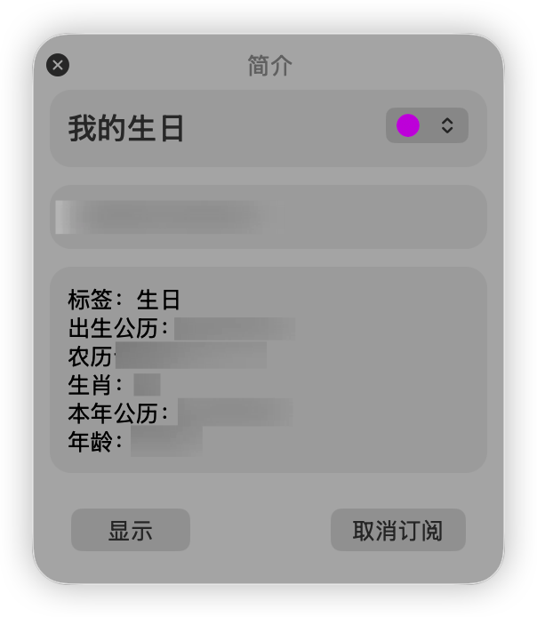

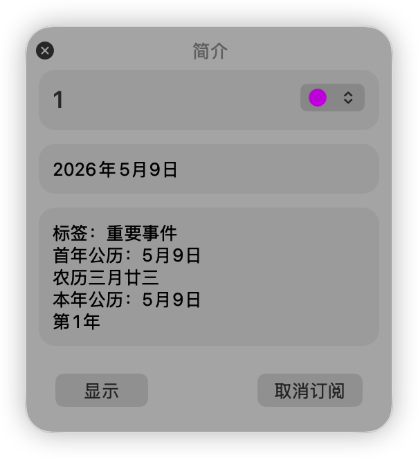

---

COS 手动上传参考：

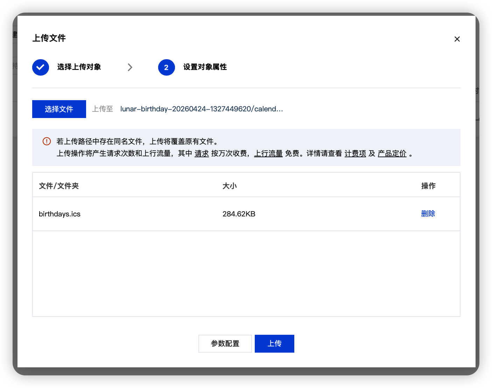

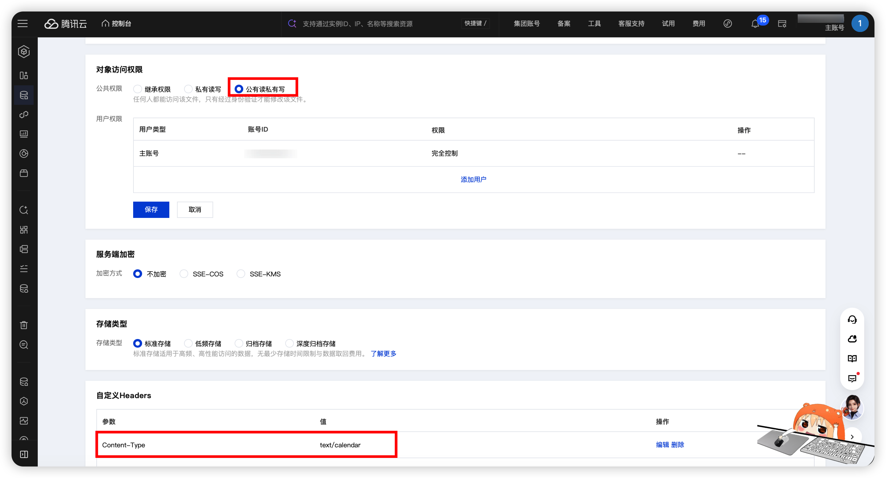

---

## 1.6 隐私与发布 GitHub

隐私数据都在 `private_data/`：

- `private_data/birthdays.db`
- `private_data/birthdays.ics`
- `private_data/cos.env`

`.gitignore` 已忽略 `private_data/*`（保留 `.gitkeep` 占位）。
`.gitignore` 也已忽略 `.idea/`（避免提交本地 IDE 配置）。

发布前建议：

```bash
git status --short
```

确认没有 `private_data` 的真实数据文件，并确认 `.idea/` 未被跟踪。

---

## 1.7 常见错误

### `Missing dependency: lunardate`

```bash
python3 -m pip install lunardate
```

### `time must be HH:MM`

时间格式错误，改成 `08:30`。

### `date must be YYYY-MM-DD`

日期格式错误，改成 `1990-08-15`。

### 2099 年后报错

当前农历库上限是 `2099`。

### `endpoint not found` / 接口返回非 JSON

通常是旧服务进程仍在运行，重启：

```bash
# 先 Ctrl+C 停掉旧进程
scripts/web.sh
```

### `生成失败：database has no enabled birthdays`

通常是数据库路径用错（项目里有旧的 `birthdays.db` 和新的 `private_data/birthdays.db`）。

处理：

1. 停掉当前服务（`Ctrl+C`）。  
2. 用脚本重启（确保走私有数据路径）：

```bash
cd /Users/apple/Documents/PyCharm/solar_birthday_cos
scripts/web.sh
```

3. 如果仍混淆，检查启用记录数量：

```bash
python3 solar_birthday.py list --db private_data/birthdays.db
```

---

## 2. 技术栈（语言、库、工程风格）

- 后端：Python 3
- 前端：原生 JavaScript + HTML + CSS
- 存储：SQLite
- 日历格式：iCalendar (`.ics`)
- 第三方依赖：`lunardate`
- 脚本：Bash

工程风格：

- 单文件核心逻辑（`solar_birthday.py`）
- CLI 和 Web 复用同一业务层
- 前端薄交互，计算放后端

---

## 3. 算法与数学模型

### 3.1 核心日期模型

设出生公历为 `S0=(Y0, M0, D0)`：

1. 转为出生农历 `L0=lunar(S0)`
2. 对每个目标年份 `Y`：
- `Y==Y0`：直接取 `S0`
- `Y>Y0`：按 `L0` 构造当年农历生日，再转回公历 `S(Y)`

### 3.2 年龄

- `age = Y - Y0`

### 3.3 提醒模型

- 默认提醒集合 `A_default`：来自页面“默认提醒天数”
- 单独提醒集合 `A_person`：来自该条记录 `alarm_days`
- 若单独提醒为空：使用默认提醒
- 若单独提醒为 `-1`：该条不生成提醒

### 3.4 ICS 事件模型

每条记录每年映射一个 `VEVENT`：

- `UID`：哈希生成
- `DTSTART/DTEND`
- `SUMMARY`
- `DESCRIPTION`
- `CATEGORIES`
- 0~N 个 `VALARM`

---

## 4. Mermaid 图

### 4.1 总流程图

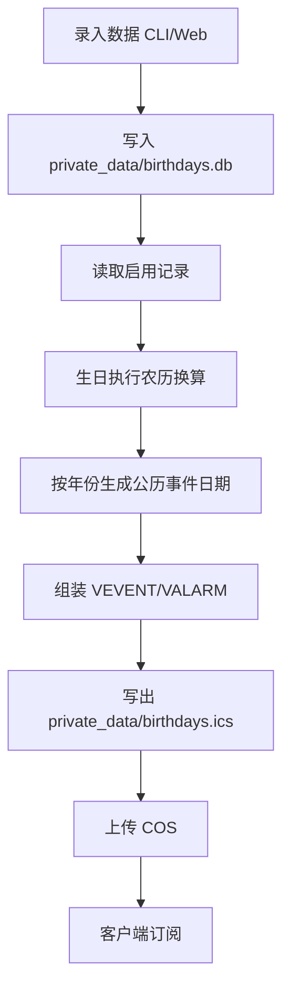

### 4.2 ER 图

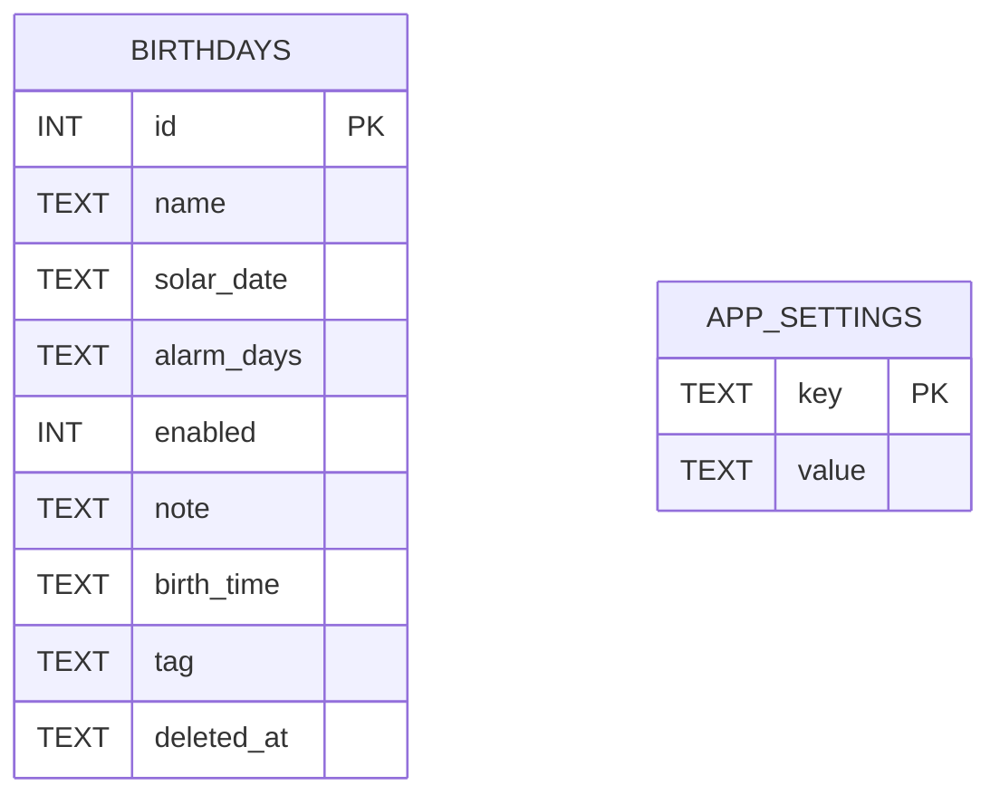

### 4.3 Web API 时序图

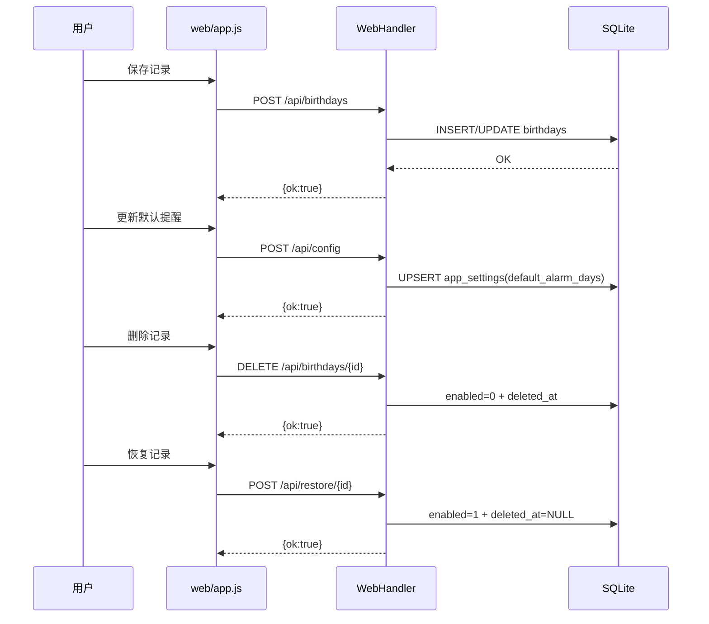

### 4.4 默认提醒 vs 单独提醒

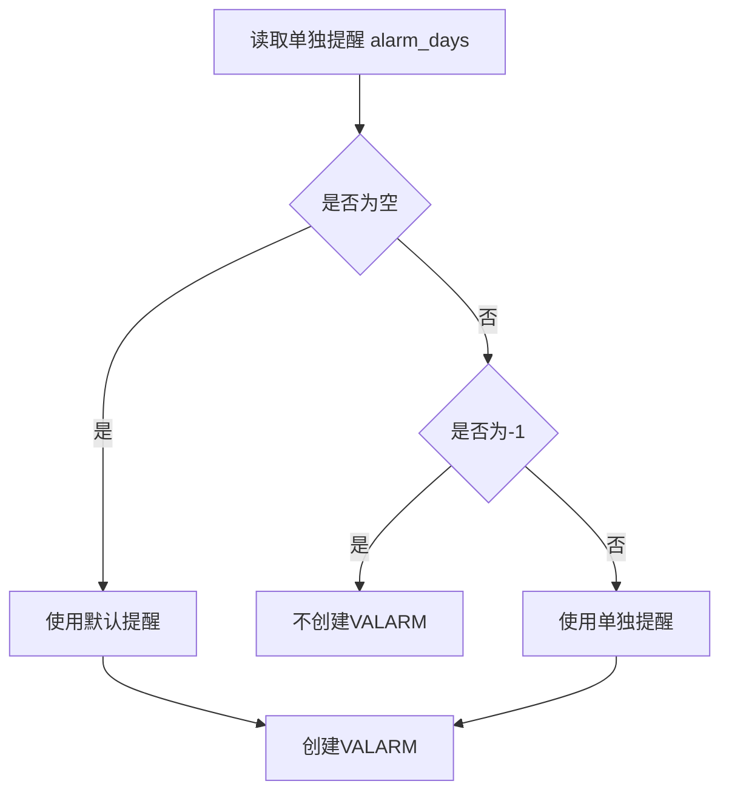

### 4.5 出生年 vs 非出生年

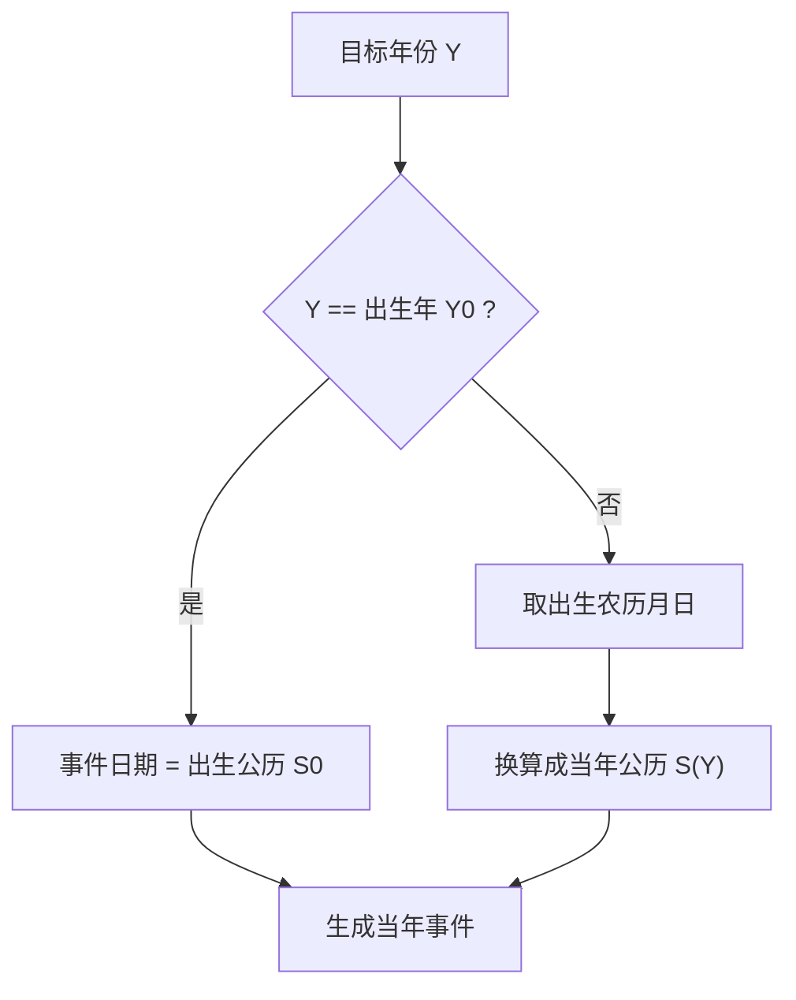

### 4.6 系统架构图

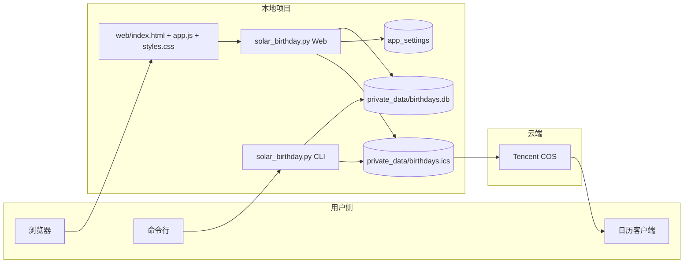

---

## 5. 一键命令清单

```bash
cd /Users/apple/Documents/PyCharm/solar_birthday_cos
python3 -m pip install lunardate
python3 solar_birthday.py init --db private_data/birthdays.db
python3 solar_birthday.py add --db private_data/birthdays.db --name "妈妈" --date 1968-03-06 --tag 生日
python3 solar_birthday.py list --db private_data/birthdays.db
scripts/generate.sh
scripts/web.sh
```

---

## 6. 注意事项

1. 农历换算上限是 `2099`。
2. 日期格式必须 `YYYY-MM-DD`，时间格式必须 `HH:MM`。
3. `private_data/birthdays.ics` 每次生成会覆盖旧文件。
4. 上传后客户端同步有缓存延迟。
5. 每次覆盖上传后都手动确认对象权限为 **公有读私有写**。
6. 发布到 GitHub 前，确认 `private_data` 未提交。
7. 发布到 GitHub 前，确认 `.idea/` 未提交（本地配置不应公开）。

---

## 开源文件

- [LICENSE](./LICENSE)
- 开源协议：GNU GPL v3.0 (GPL-3.0)

## Maintainer

- GitHub: [@CHNragdoll](https://github.com/CHNragdoll)
- Email: notion@dad.ac.cn

## 致谢

- 感谢 [lidaobing/python-lunardate](https://github.com/lidaobing/python-lunardate) 提供农历换算能力支持。

## Contributors

<!-- ALL-CONTRIBUTORS-LIST:START - Do not remove or modify this section -->
<!-- prettier-ignore-start -->
<!-- markdownlint-disable -->
| [<br /><sub><b>CHNragdoll</b></sub>](https://github.com/CHNragdoll) |
| :---: |
| 💻 📖 ⚠️ 🚇 |

<!-- markdownlint-restore -->
<!-- prettier-ignore-end -->
<!-- ALL-CONTRIBUTORS-LIST:END -->

本项目使用 [all-contributors](https://allcontributors.org/) 规范维护贡献者列表。
